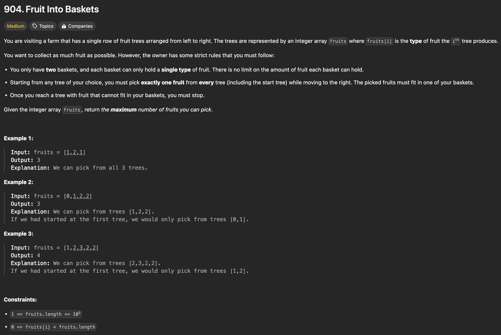

```java
import java.util.Map;
import java.util.HashMap;

class Solution {
    public int totalFruit(int[] fruits) {
        int l = 0;
        Map<Integer, Integer> basket = new HashMap<>();
        int maxBasketSize = 2;
        int curNumOfFruits = 0;
        int maxNumOfFruits = 0;

        for (int r = 0; r < fruits.length; ++r) {
            basket.put(fruits[r], basket.getOrDefault(fruits[r], 0) + 1); // put the current fruit in the basket
            curNumOfFruits++; // increase the current total number of fruits

            while(basket.size() > maxBasketSize) { // if basket exceeds its size
                Integer fruitToBeRemoved = fruits[l];
                basket.put(fruitToBeRemoved, basket.get(fruitToBeRemoved) - 1); // remove fruits from the left
                curNumOfFruits--; // decrease the current total number of fruits
                l++; // move left pointer
                if (basket.get(fruitToBeRemoved) == 0) basket.remove(fruitToBeRemoved); // if all the fruits are taken out, remove it from the basket
            }

            maxNumOfFruits = Math.max(maxNumOfFruits, curNumOfFruits);
        }

        System.out.println(maxNumOfFruits);
        return maxNumOfFruits;


        // First try (won't work)
        // int l = 0;
        // List<Integer> basket = new ArrayList<>();
        // int maxBasketSize = 2;
        // int curNumOfFruits = 0;
        // int maxNumOfFruits = 0;

        // for (int r = 0; r < fruits.length; ++r) {
        //     int curFruit = fruits[r];
        //     if (!basket.contains(curFruit)) { // if basket doesn't have the current fruit
        //         if (basket.size() < maxBasketSize) basket.add(curFruit); // if basket has space, put it in the basket
        //         else { // if basket is full
        //             basket.remove(0); // take out the first fruit
        //             basket.add(curFruit); // put the current fruit in the basket
        //             l = r - 1; // move l pointer to the first fruit
        //         }
        //     }

        //     maxNumOfFruits = Math.max(maxNumOfFruits, r - l + 1);
        // }

        // return maxNumOfFruits;
    }
}
```