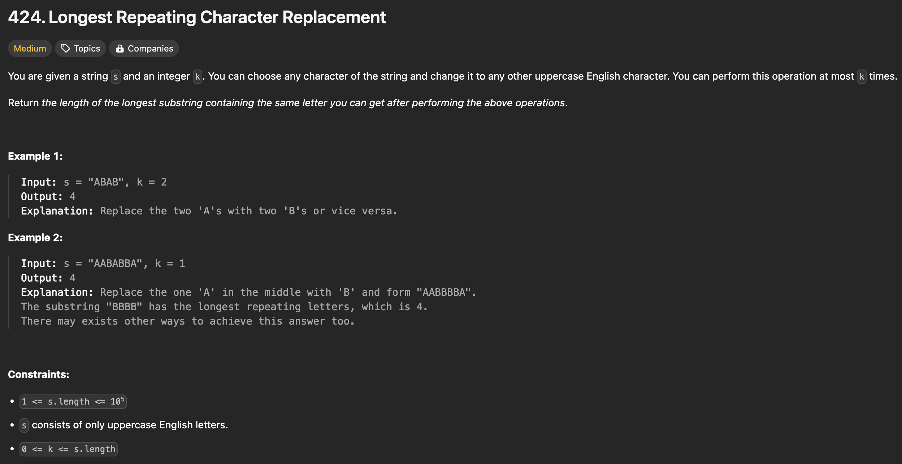

```java
import java.util.HashMap;
import java.util.Map;
import java.util.Optional;

class Solution {
    public int characterReplacement(String s, int k) {
        int l = 0;
        int maxLength = 0;
        Map<Character, Integer> count = new HashMap<>(); 

        for (int r = 0; r < s.length(); ++r) {
            // store current character's frequency
            int curFreq = count.getOrDefault(s.charAt(r), 0); 
            count.put(s.charAt(r), curFreq + 1);

            // get maximum frequency
            Optional<Integer> possibleMaxFreq = count
                    .values()
                    .stream()
                    .max((Integer val1, Integer val2) -> val1.compareTo(val2));
            int maxFreq = possibleMaxFreq.orElse(0);

            // int curLength = r - l + 1; // this shouldn't be here because it could be updated after if statement
            if (((r - l + 1) - maxFreq) > k) { // if characters need to be replaced is greater than k
                count.put(s.charAt(l), count.get(s.charAt(l)) - 1);  // decrease the count of left pointer's char and move the pointer to the next char
                l++;
            }

            maxLength = Math.max(maxLength, (r - l  + 1));
        }
        
        return maxLength;
    }
}
```
