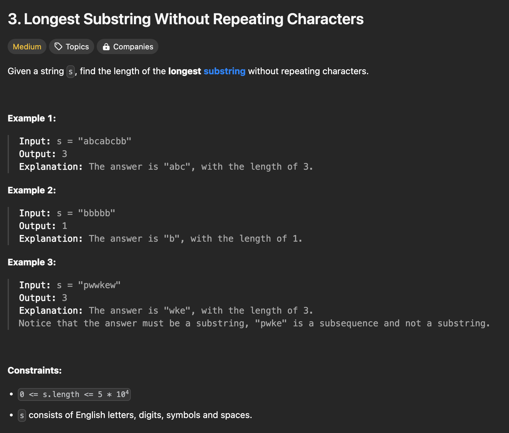

```java
class Solution {
    public int lengthOfLongestSubstring(String s) {
        int l = 0;
        int maxLength = 0;
        int curLength = 0;
        Map<Character, Integer> count = new HashMap<>();

        // count length of substring by moving pointers
        for (int r = 0; r < s.length(); ++r) {
            char curChar = s.charAt(r);
            count.put(curChar, count.getOrDefault(curChar, 0) + 1);
            curLength++;

            if (count.get(curChar) > 1) { // if it encounters the existing character (if any count of char is greater than 1)
                // move left pointer until the count of all chars in the map are equal to 1
                while (count.get(curChar) > 1) {
                    char charToBeRemoved = s.charAt(l);
                    count.put(charToBeRemoved, count.get(charToBeRemoved) - 1);
                    curLength--;
                    l++;
                }
            }

            maxLength = Math.max(maxLength, curLength);
        }

        return maxLength;
    }
}
```