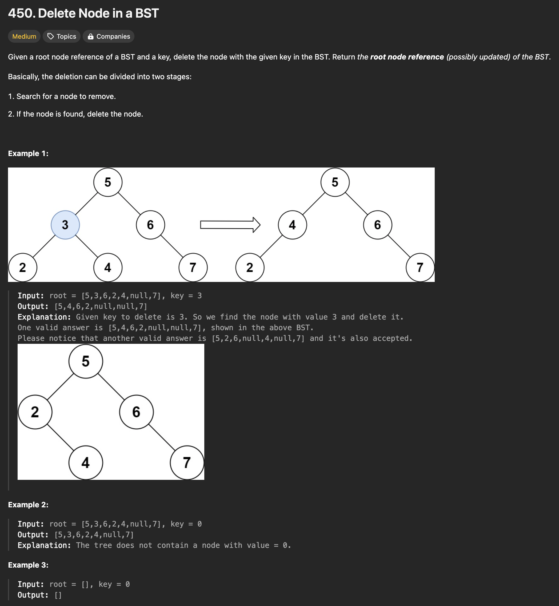

```java
/**
 * Definition for a binary tree node.
 * public class TreeNode {
 *     int val;
 *     TreeNode left;
 *     TreeNode right;
 *     TreeNode() {}
 *     TreeNode(int val) { this.val = val; }
 *     TreeNode(int val, TreeNode left, TreeNode right) {
 *         this.val = val;
 *         this.left = left;
 *         this.right = right;
 *     }
 * }
 */
class Solution {
    public TreeNode deleteNode(TreeNode root, int key) {
        if (root == null) return null;
        
        if (key < root.val) {
            root.left = deleteNode(root.left, key);
        } else if (key > root.val) {
            root.right = deleteNode(root.right, key);
        } else { // if root.val == key
            if (root.left == null) return root.right;
            else if (root.right == null) return root.left;
            else { // if root.left and root.right both exist
                TreeNode cur = root.right;
                while (cur.left != null) { // find minimum node can replace the current root
                    cur = cur.left;
                }
                root.val = cur.val;
                root.right = deleteNode(root.right, cur.val);
            }
        }
        return root;
    }
}
```