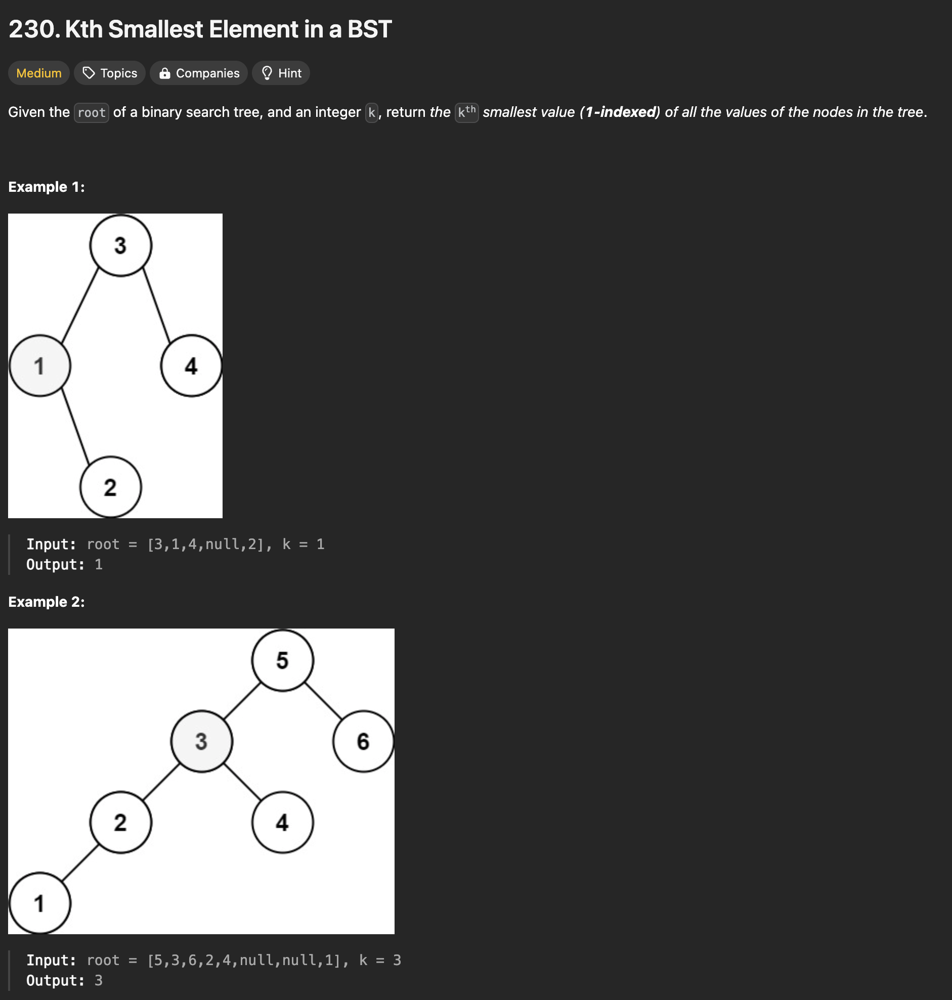

```java
/**
 * Definition for a binary tree node.
 * public class TreeNode {
 *     int val;
 *     TreeNode left;
 *     TreeNode right;
 *     TreeNode() {}
 *     TreeNode(int val) { this.val = val; }
 *     TreeNode(int val, TreeNode left, TreeNode right) {
 *         this.val = val;
 *         this.left = left;
 *         this.right = right;
 *     }
 * }
 */
//  simple solution with array list
//class Solution {
//    public int kthSmallest(TreeNode root, int k) {
//        List<Integer> values = new ArrayList<>();
//        traverse(root, values);
//        return values.get(k - 1);
//    }
//
//    private void traverse(TreeNode root, List<Integer> values) {
//        if (root == null) return;
//
//        traverse(root.left, values);
//        values.add(root.val);
//        traverse(root.right, values);
//    }
//}

// Solution with Stack
 class Solution {
     public int kthSmallest(TreeNode root, int k) {
         Stack<TreeNode> stack = new Stack<>();

         // push all left nodes (stack top will be the minimum)
         while (root != null) {
             stack.push(root);
             root = root.left;
         }

         while (k != 0) {
             // pop which is the current minimum element
             TreeNode minimumNode = stack.pop();
             k--;
             if (k == 0) return minimumNode.val;
             // if right node exist, push to the stack since it's the next minimum element
             TreeNode rightNode = minimumNode.right;
             while (rightNode != null) {
                 stack.push(rightNode);
                 // if right node's left exist, it should be pushed to the stack since it's the next minimum element
                 rightNode = rightNode.left;
             }
         }

         return -1;
     }
 }
```