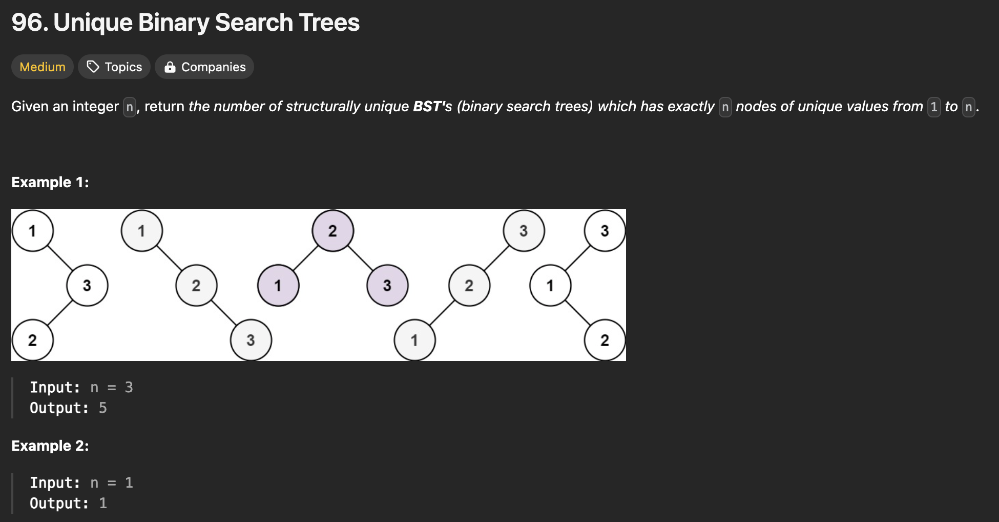

```java
class Solution {
    public int numTrees(int n) {
        /* Given the n nodes, the possible combination of BST can be calculated like:
        *  Let's say G(n) is the number of unique BST having the length n
        *            F(i, n) is the number of unique BST, where the number i is the root
        *  G(n) = F(1, n) + F(2, n) + ... + F(n, n)
        *  which has DP's structure. So we can calculate its base case and recurse the solution
        *  base case can be 1 where G(1) = F(1, 1) = 1 
        *  But we are recursively call this solution with (i - 1) or (n - i) can be 0, so we need to include 0 as a base case as well
        */ 
        if (n == 0 || n == 1) return 1;
        
        int sum = 0;
        for (int i = 1; i <= n; ++i) {
            sum += numTrees(i - 1) * numTrees(n - i);
        }
        return sum;

        // First solution came up with: the number of unique bst made of previous number + the number of unique bst when the n node is the root(difficult to implement)        
    }
}
```